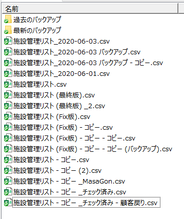
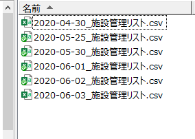
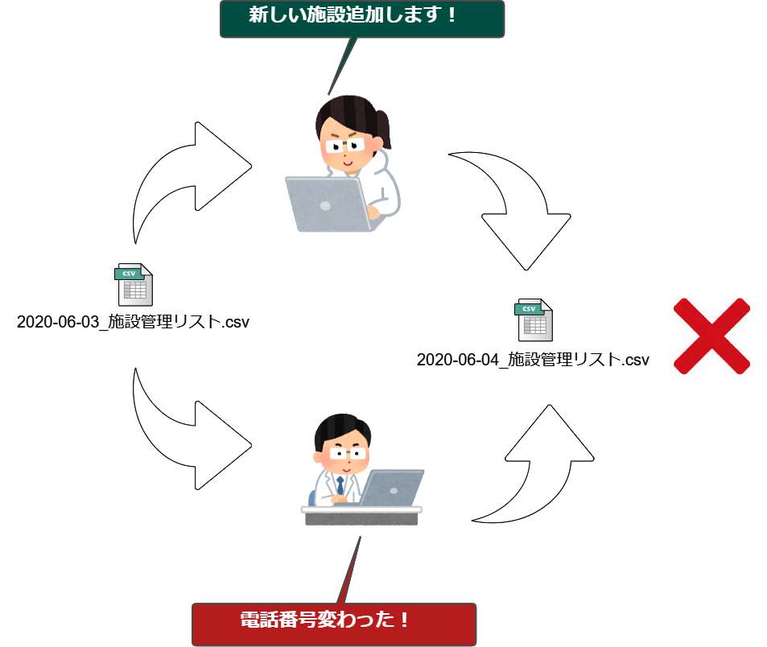
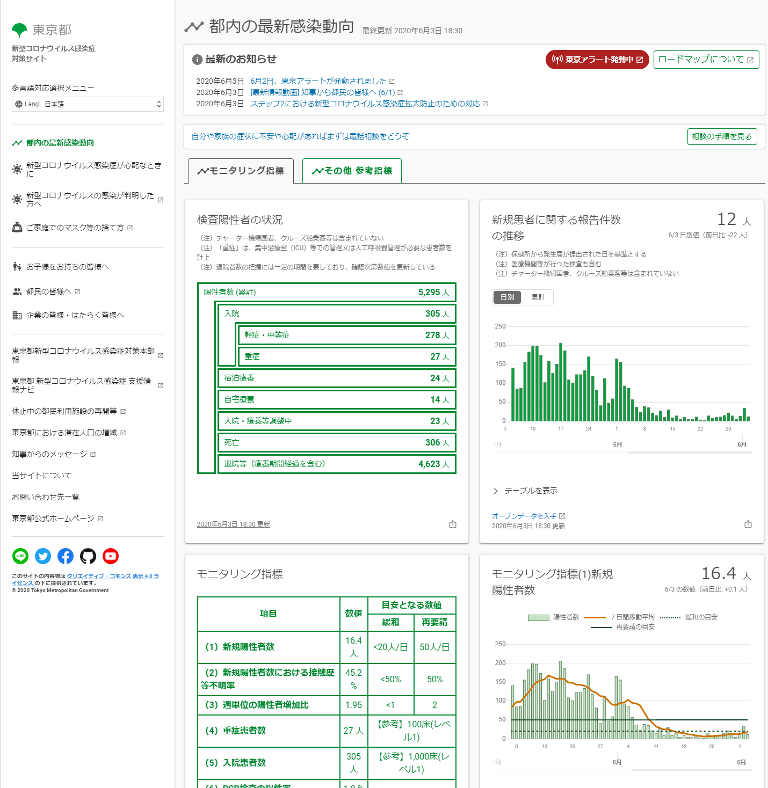
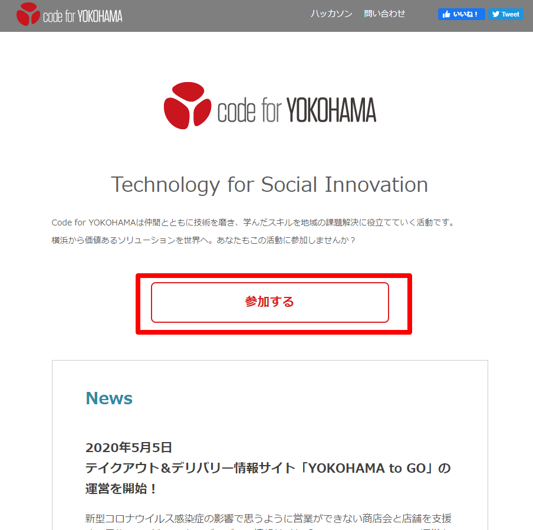
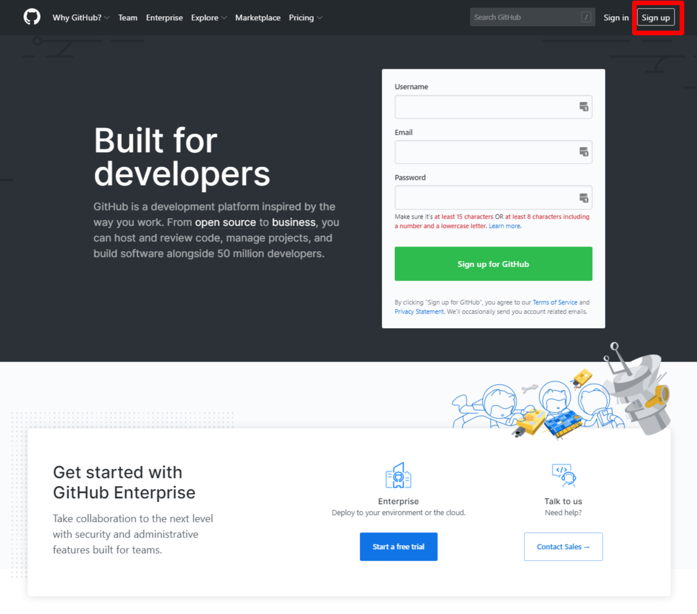
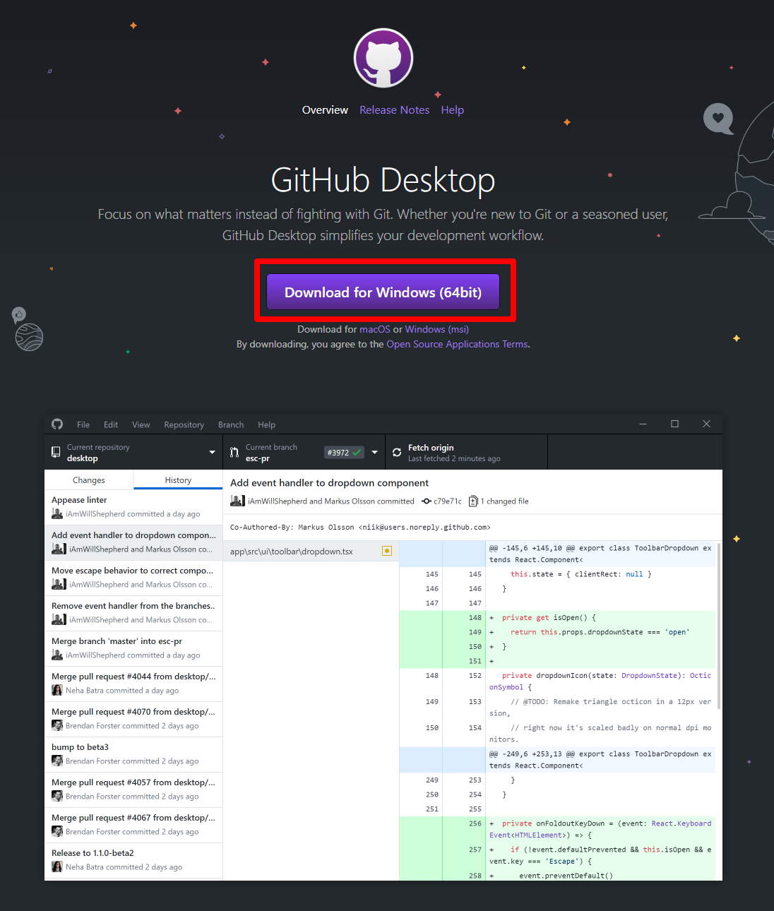
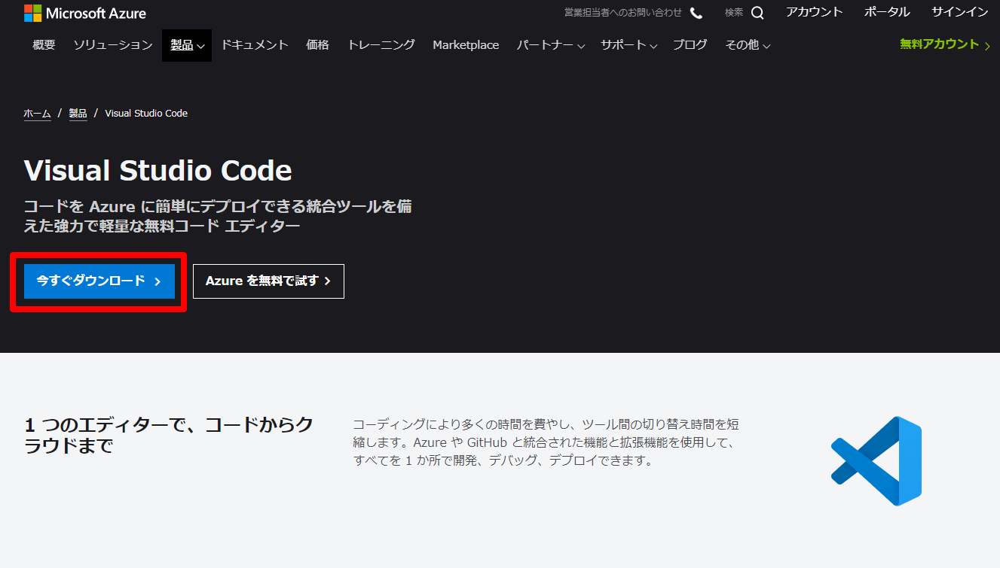
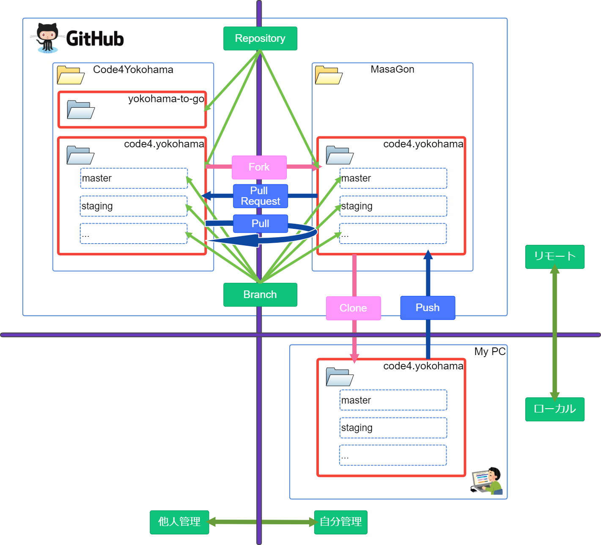

# Code for YOKOHAMA GitHub講座

## 講師

- 肥田野 正輝 (Code for YOKOHAMAコアメンバー/インフォ・ラウンジ代表)

## 日時

- 6月4日（木）19:00〜（1時間半程度を予定）
- ZOOM開催 (URLはSlackで連絡)

## 注意事項

- 発言時以外はZoomの音声はミュートでお願いします

---

## 本日の進め方

- 前半はZoomで説明を行い、後半にハンズオンを行います。
- 途中参加・退出は自由です。特に断らずご自由にどうぞ。
- Zoomは記録のために録画します。一般公開は想定しておりませんが、お顔が映り込むのがNGの方はビデオを常時オフにしておいてください。
- 最後に質問タイムを設けます。質問がある方はミュートを解除して発言をお願いします。
- 講座中の質問はSlackの#hands-onチャンネルで受け付けます。C4Yのサポートチームが待機しております。
- 終了後にオンライン懇親会をやります。参加希望者はそのまま残ってください。

---

## 自己紹介

- 名前: 肥田野 正輝 (ひだの まさき)
- ハンドル名: MasaGon
- 職業: (いちおう)会社経営者
- Code fro YOKOHAMAにおけるポジション: CRO (Chef Ramen Officer) <さっき決めた>
- 週末の顔: ラッパ吹き
- 好きなクラウド: Google Cloud Platform
- 好きなサービス: Cloud Functions

---

## 本日のメニュー

### 導入篇

    1. GitHubってなに？
    2. 東京都のCovid19サイトではどうやって使ってる？

### ハンズオン編

    1. 事前準備の確認
    2. GitHubにログイン
    3. issueを登録してみよう
    4. Forkしてみよう
    5. Cloneしてみよう
    6. 編集してCommitしてみよう
    7. プルリクを出してみよう

---

## 導入編

### 1. GitHubってなに

---

#### Git と GitHub

- 混同するとネットで怒られるやつ (Wiki vs WikiPedia)

##### Git

    - ソースコードなどの変更履歴を記録・追跡するための分散型「バージョン管理システム」つまり「ツール名」
    - Linuxの開発者のリーナスさん（えらい人）が作った

##### GitHub

    - 開発者のための「プラットフォーム」つまり「サービスの名前」
    - 中でGitが動いている (Gitのためのハブ)

---

#### なぜバージョン管理が必要なのか？

---

#### よく見る光景

あなたのフォルダー、こんな感じですよね？

---

#### フォルダー見といて！

どれみればいいねん！

---

#### だいぶ良くなった？

- 日付の桁数も揃ってる
- 名前でソートすれば日付順に揃う

---

#### 衝突！

俺の修正どこ行った？！

---

#### バージョン管理システムに求められる要件

- ファイルの変更の履歴が記録される（いつ、だれが、どこを、どんなふうに）
- 間違って変更したら直ぐに元に戻せる
- 複数人で管理して衝突してもどちらかが泣くことがない
- いつでも立ち戻って確認が出来る
- ファイル単位ではなく、行単位、文字単位で差分がわかる

---

#### 全部出来るさ！

そう、GitHubならね！

---

## 導入編

### 2. 東京都のCovid19サイトではどうやって使ってる？

---

#### 東京都新型コロナ感染症対策サイト

---

#### YOKOHAMA to GO

---
## ハンズオン編

### 1. 事前準備の確認

---

0. (未登録の方) Code for YOKOHAMAのSlackに登録する
    - Code for YOKOHAMAの公式コミュニケーションツールです。
    - 講座の途中で必要なリンクや説明を送ることがあります。
    - https://join.slack.com/t/code4yokohama/shared_invite/zt-e63peaf8-AIxGiecu5IgR2DHAiv~c~g
    - #hands-on チャンネルにも登録をお願いします。

---

1. GitHubアカウントを作る
    - アカウント登録にはメールアドレスが必要です。登録は無料です。
    - https://github.com/join?ref_cta=Sign+up&ref_loc=header+logged+out&ref_page=%2F&source=header-home

---

2. GitHub Desktopをインストール
    - GitHubを操作するために使うデスクトップアプリです。
    - 今回はコマンドラインからの操作は極力避けるために、こちらを使います。
    - 無償で使うことができます。
    - https://help.github.com/ja/desktop/getting-started-with-github-desktop/installing-github-desktop

---

3. Visual Studio Codeをインストール
    - エンジニア御用達の高機能テキストエディタです
    - 無償で使うことができます
    - https://azure.microsoft.com/ja-jp/products/visual-studio-code/

---

4. プロフィール画像に使える適当な画像ファイルを用意
    - 例題として、Code for YOKOHAMAのメンバープロフィールの編集にチャレンジします
    - かならずしも、本人の顔写真である必要はありません
    - 他者の権利を害さない画像をご用意ください

---

## ハンズオン編

### 今日の全体像

---

## ハンズオン編

### 2. GitHubにログイン

- ログインが済んだら下記を別タブで開いておいてください
    - Code for YOKOHAMA ウェブサイト: https://code4.yokohama/
    - Code for YOKOHAMA GitHubレポジトリ: https://github.com/Code4Yokohama/code4.yokohama

---

## ハンズオン編

### 3. Issueを登録してみよう

- Code for YOKOHAMAのGitHubレポジトリにIssueを登録してみましょう
- 今回はテストなので、タイトルを[HandsOn]から始めてください

---

## ハンズオン編

### 4. Forkしてみよう

- フォーク先は自分のユーザー名の配下です

---

## ハンズオン編

### 5. Cloneしてみよう

- 自分のGitHubレポジトリからローカル（自分のパソコン）にCloneします

---

## ハンズオン編

### 6. 編集してCommitしてみよう

- 今回はメンバーページに自分のプロフィールを登録してみましょう
- /member/iwao_kobayashi というディレクトリ（フォルダー）があるので、それをディレクトリ（フォルダー）ごとコピーして、自分の名前など（アルファベット）に変えてみましょう (例: /member/masagon )
- コミットメッセージを入力してコミットしましょう (masterブランチ)
- 自分のGitHubにPushしましょう

---

## ハンズオン編

### 7. プルリクを出してみよう

- プルリクとは、Pull Requestのこと。自分の編集を本家に取り込んでもらうためのお願いです
- レポジトリーのオーナーでなくても、GitHubのアカウントを持っていれば誰でもリクエストできます
- 今回はテストなので、タイトルを[HandsOn]から始めてください

※参加者の皆さんの作業はここまでです。お疲れ様でした！

---

## ハンズオン編

### 8. Mergeします

- Mergeとは、皆さんからのプリリクを本家に取り込む作業です
- レポジトリーのオーナのみが実行できます
- C4Yのスタッフがみなさんのプルリクをマージします
- C4Yのウェブサイトに反映されているか確認しましょう
    https://code4.yokohama/member/<先ほど作ったディレクトリ名>/

※ハンズオンは以上でお疲れ様でした！
